# Hi, I'm Andrei Sundakov

**Full-stack developer in Berlin, building practical web products end to end.**

I work across React, Next.js, Vue, Node.js, Python, Go, and data-backed systems - with a finance background that helps me understand product tradeoffs beyond the code.

---

## About Me

<table>
  <tr>
    <td width="55%" valign="top">
      <h3>What I Build</h3>
      

        I build full-stack web apps with thoughtful frontend experiences, reliable backend services,
        and data models that stay maintainable as the product grows.
      

      

        Four years of freelance work taught me how to move quickly, talk to clients clearly,
        and choose boring, dependable tools when that is what the product needs.
      

    </td>
    <td width="45%" valign="top">
      <h3>Current Focus</h3>
      <ul>
        <li>Based in Berlin on a job seeker visa</li>
        <li>Open to full-time roles in Berlin or remote</li>
        <li>Strongest in React, Next.js, Vue, Node.js, Python, Go, and SQL</li>
        <li>Finance background from university studies and a Tinkoff Bank internship</li>
      </ul>
    </td>
  </tr>
</table>

---

## Tech Stack

### Languages

### Frontend

### Backend, Data, and Cloud

---

## Featured Work

<table>
  <tr>
    <td width="50%" valign="top">
      
    </td>
    <td width="50%" valign="top">
      <h3>Yamaghen Ride</h3>
      

        Ride-booking platform focused on electric vehicles, transparent pricing, CO2 tracking,
        and in-app Deutschlandticket purchase flows.
      

      

        Built with Next.js, TypeScript, MongoDB, and Sentry.
      

      

        
        
        
        
      

    </td>
  </tr>
</table>

<table>
  <tr>
    <td width="50%" valign="top">
      <h3>Appwrite + Vue Auth Starter Kit</h3>
      

        A starter kit with signup, login, password reset, OAuth providers, and a role-based dashboard
        for authenticated users.
      

      

        Published with setup docs so new projects can start from a working auth flow instead of
        reimplementing the same foundation.
      

      

        
        
        
        
      

    </td>
    <td width="50%" valign="top">
      <h3>What I Like Working On</h3>
      <ul>
        <li>Auth, dashboards, booking flows, and workflow-heavy web apps</li>
        <li>APIs that are simple to consume and easy to maintain</li>
        <li>Products where frontend polish and backend reliability both matter</li>
        <li>Teams that value clear communication and steady iteration</li>
      </ul>
    </td>
  </tr>
</table>

---

## GitHub Activity

<!-- Generated by .github/workflows/readme-stats.yml. Add GH_README_STATS_TOKEN to include private repository stats. -->

 

---

## Education, Certification, and Languages

    <table>
    <tr>
        <td width="50%" valign="top">
        <h3>Education</h3>
        

            <strong>University of Europe for Applied Sciences</strong> 
            B.Sc. Software Engineering, Feb 2023 - Feb 2026
        

        

            <strong>Financial University</strong> 
            B.Sc. Operations &amp; Business Management, Sep 2019 - Jun 2022
        

        </td>
        <td width="50%" valign="top">
        <h3>Certification</h3>
        

            
        

        <h3>Languages</h3>
        

            English C1 
            German B1 
            Russian native
        

        </td>
    </tr>
    </table>

---

### Let's Build Something Useful

Open to full-time roles in Berlin or remote. Feel free to reach out.

